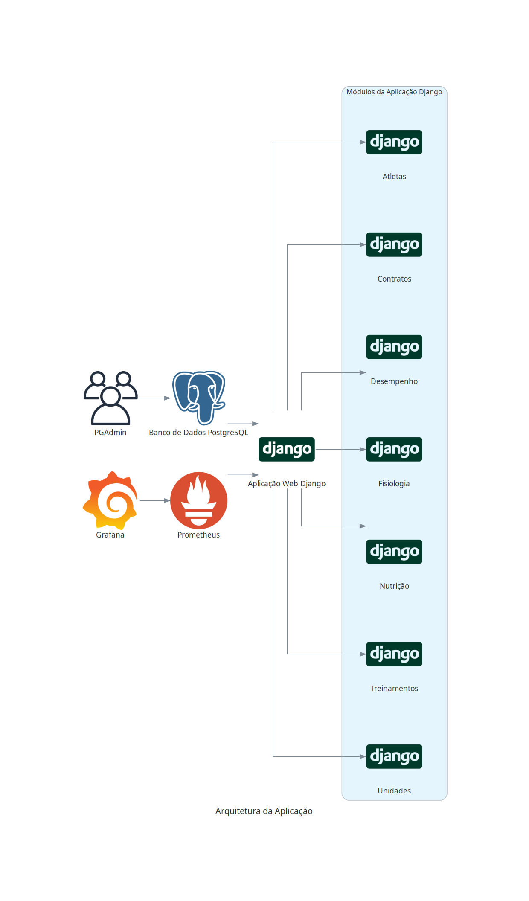

# Logicus Atletas

## O que é o Logicus Atletas?

O Logicus Atletas é um software para gerenciamento de organizações esportivas que possui módulos para organização e gerenciamento de atletas, contratos, desempenho, eventos, fisiologia, nutrição, treinamentos e unidades.

## Como é feita a aplicação?

A aplicação foi desenvolvida em Python utilizando o framework Django. Para a infraestrutura, utilizamos Docker Compose, que orquestra os seguintes serviços:

- **Banco de Dados:** PostgreSQL, com interface administrativa pelo PG Admin.
- **Monitoramento:** Prometheus para coleta de métricas e Grafana para visualização e análise dessas métricas.

### Pré-requisitos

Para rodar o projeto, é necessário ter instalado:

- Docker
- Docker Compose
